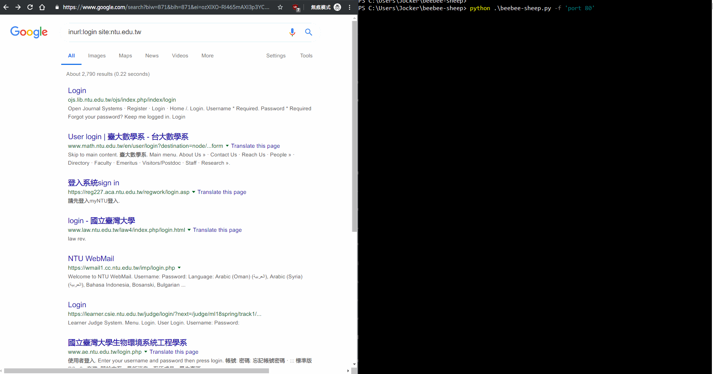

# beebee-sheep
This is a simple password sniffer based on scapy,  
Allowing user to custom the BPF filter and regex pattern.  
It may be useful in cooperation with arpspoofing tools.  
## Requeirments
* python3: scapy and colorama
* Npcap for windows users
## Usage
`beebee-sheep.py [-h] [-c COUNT] [-p PCAP] [-f FILTER] [-r REGEX] [-i IFACE]`
* `-c COUNT` is number of packets to capture. 0 means infinity.
* `-p PCAP` is the PCAP file to read packets from, instead of sniffing them.
* `-f FILTER` is the BPF filter to apply.
* `-r REGEX` is regex expression as password pattern.
* `-i IFACE` is given as network interface.
## Demo

